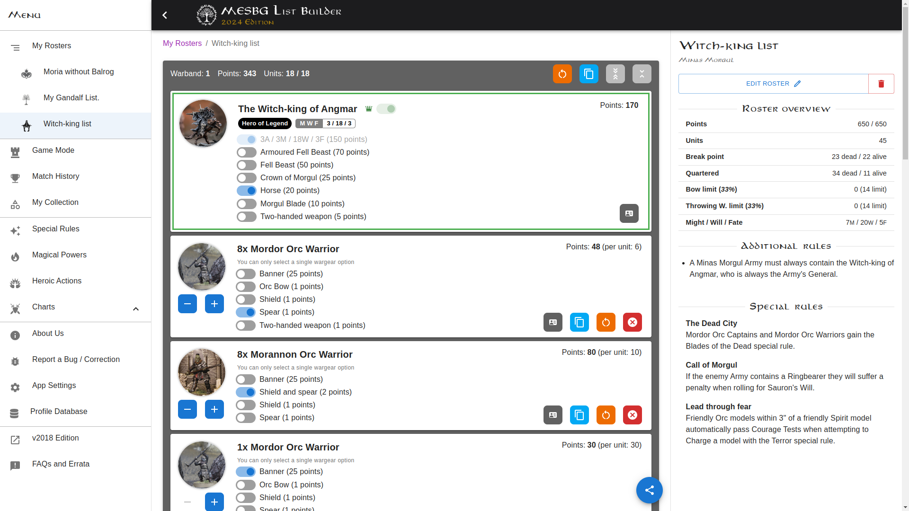
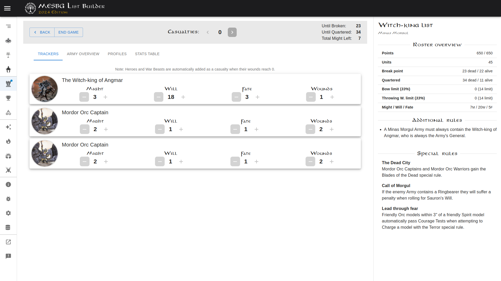
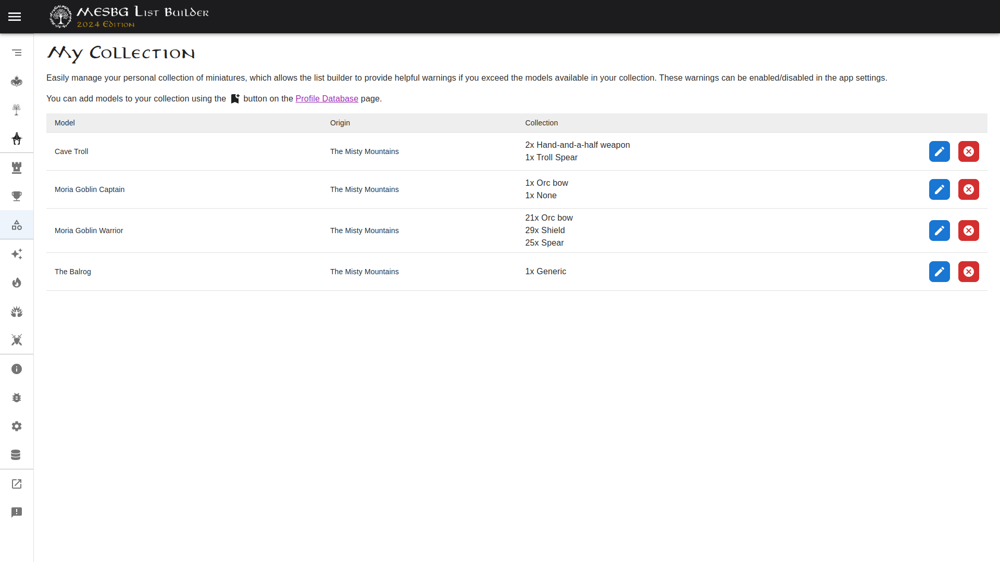

# MESBG List Builder (2024 Edition)

*https://v2024.mesbg-list-builder.com*

A simple and intuitive tool for building your army lists for the Middle-Earth Strategy Battle Game (MESBG).

<!-- TOC -->
* [Feature Highlights](#feature-highlights)
* [Usage](#usage)
* [Contact information](#contact-information)
* [Contributing](#contributing)
* [Helpful information](#helpful-information)
  * [PWA Installation](#pwa-installation)
    * [Desktop (PWA)](#desktop-pwa)
    * [Android (PWA)](#android-pwa)
    * [iOS (PWA)](#ios-pwa)
  * [Screenshots of the application](#screenshots-of-the-application)
    * [List Building](#list-building)
    * [Digital trackers (Gamemode)](#digital-trackers-gamemode)
    * [Collection management](#collection-management)
<!-- TOC -->

## Feature Highlights:

- Installable Desktop and Mobile application though PWA. (Available for [Desktop](#desktop-pwa), [Android](#android-pwa)
  and [iOS](#ios-pwa))
- Custom-made profile cards for all models across The Lord of the Rings and The Hobbit ranges.
- All available army lists included.
  - Warnings provided for invalid combinations and incorrect army lists.
- Easy-to-share screenshot of your roster list, or alternatively use text-print view.
- Gamemode features
  - PDF print-out for your list, providing all profile stats, special rules, magical powers, Might/Will/Fate/Wounds
    tracking etc.
  - Digital trackers that allow you to track the Might/Will/Fate/Wounds of your heroes & casualties. Complete with
    break point
    calculation, display of army bonuses and profile cards.
- Match History
  - Keeping track of your match results when ending a game though the Digital trackers
  - Record matches manually when not using the digital trackers
  - Get a full breakdown of your results per opponent, army and scenario.
- Collection/Inventory warnings (opt-in<small>[1]</small>)
  - Manage which models and loadouts you have in your collection
  - Get warnings when building your army lists for models you don't own or have enough of
- Browser storage used to persist your data allowing you to continue building and tracking at a later point.
  - Import/Export functionality for your army lists and match history to keep your data safe.

<small>_[1]_; These features are not enabled by default. You can enable them
in [the site/app settings](https://v2024.mesbg-list-builder.com/settings).</small>

## Usage

If you want to use the list builder you can head over to *https://v2024.mesbg-list-builder.com* and start by creating
your first army list.

## Contact information

If you want to reach out to us to ask questions, report bugs or provide ideas for enhancements, you can do that via;

- Our support mailbox: support@mesbg-list-builder.com
- Raise and issue on this GitHub
  repository ([by clicking here](https://github.com/avcordaro/mesbg-list-builder-v2024/issues/new?template=Blank+issue))
- Reddit, by DM'ing either [/u/Wisemonkey007](https://www.reddit.com/user/Wisemonkey007)
  or [/u/mjollnir94](https://www.reddit.com/user/mjollnir94/)
- Join [the MESBG discord](https://discord.gg/MZfUgRtV56) and go to
  the [mlb-list-builder-and-bug-report](https://discordapp.com/channels/298528506311213066/1322542459439546368) channel.

## Contributing

Pull requests are welcome. For major changes, please open an issue first to discuss what you would like to change.

<!--

TODO: Following chapters still need to be written.

### Installation & Setup

### Adding features

### Testing

### Documentation

-->

## Helpful information

### PWA Installation

#### Desktop (PWA)

Desktop PWA installation is currently supported by Google Chrome and Microsoft Edge on Linux, Windows, macOS, and
Chromebooks. These browsers will show an install-badge (icon) in the URL bar, stating that the current site is
installable. This badge is located next to the bookmark badge.

#### Android (PWA)

On Android, PWA install prompts differ by device and browser. Users may see:

- Variations in the wording of the menu item for install such as Install or Add to Home Screen.
- Detailed installation dialogs.

If the website does not propt you to install the application you can forcefully install it using the chrome options.
Clicking the 3-dots at the top right and then selecting the "Add to home screen" option.

#### iOS (PWA)

A browser prompt to install your PWA doesn't exist On iOS and iPadOS. On these platforms PWAs are also known as home
screen web apps. These apps have to be added manually to the home screen via a browser share menu.

**The steps to add apps to the home screen are:**

1. Open the Share menu, available at the bottom or top of the browser.
2. Click **Add to Home Screen**.
3. Confirm the name of the app; the name is user-editable.
4. Click **Add**. On iOS and iPadOS, bookmarks to websites and PWAs look the same on the home screen.

### Screenshots of the application

#### List Building

#### Digital trackers (Gamemode)

#### Collection management

